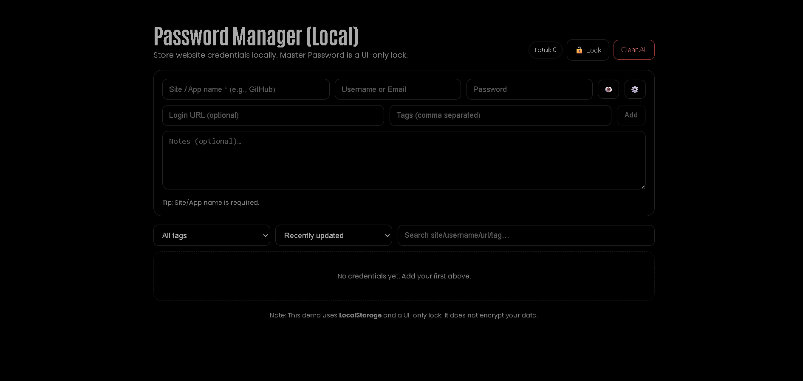

# Password Manager (Local) — React + styled-components



Store website/app credentials locally with a simple **Master Password UI lock** (visual gate only). No backend, dark-theme friendly, and fully **LocalStorage** powered.

## ⚠️ Security Note

This is a **mini-project** for UI/UX practice. The “Master Password” is **UI-only** (no real encryption). For production, use the **Web Crypto API** (PBKDF2/Argon2 + AES-GCM) and never store secrets in plaintext.

## Features

-   **Master Password lock screen** (UI-only; session-based unlock/lock)
-   Add credentials: **site/app**, **username/email**, **password**, **login URL**, **tags**, **notes**
-   **Reveal/Hide** password, **Copy** username/password/URL, **Generate** random password
-   Inline **edit**, **duplicate**, **delete** with confirm modal
-   **Single-row filter bar** (wraps on small screens): filter by **Tag**, **Sort**, **Search**
-   Responsive layout with transparent cards and subtle borders (dark-theme friendly)
-   Data persists in **LocalStorage** (refresh-safe)

## Local Install

```bash
git clone https://github.com/a2rp/password-manager.git
cd password-manager
npm i
npm run dev
```

## Links

- Portfolio: [https://www.ashishranjan.net](https://www.ashishranjan.net)
- GitHub: [https://github.com/a2rp](https://github.com/a2rp)
- CodePen: [https://codepen.io/ash1198](https://codepen.io/ash1198)
- LinkedIn: [https://www.linkedin.com/in/aashishranjan](https://www.linkedin.com/in/aashishranjan)
- Facebook: [https://www.facebook.com/theash.ashish/](https://www.facebook.com/theash.ashish/)
- YouTube: [https://www.youtube.com/@ashishranjan-ashz?sub_confirmation=1](https://www.youtube.com/@ashishranjan-ashz?sub_confirmation=1)
- Email: [ash.ranjan09@gmail.com](mailto:ash.ranjan09@gmail.com)

## Support

- Support: [https://a2rp-donation-page.netlify.app/](https://a2rp-donation-page.netlify.app/)
- Buy Me A Coffee: [https://buymeacoffee.com/a2rp](https://buymeacoffee.com/a2rp)
- Patreon: [https://patreon.com/a2rp](https://patreon.com/a2rp)
<!-- Project links -->

## Links

- Live: [https://a2rp.github.io/password-manager/](https://a2rp.github.io/password-manager/)
- Repository: [https://github.com/a2rp/password-manager](https://github.com/a2rp/password-manager)
- Portfolio: [https://www.ashishranjan.net/](https://www.ashishranjan.net/)
- GitHub: [https://github.com/a2rp](https://github.com/a2rp)
- CodePen: [https://codepen.io/ash1198](https://codepen.io/ash1198)
- LinkedIn: [https://www.linkedin.com/in/aashishranjan](https://www.linkedin.com/in/aashishranjan)
- Facebook: [https://www.facebook.com/theash.ashish/](https://www.facebook.com/theash.ashish/)
- YouTube: [https://www.youtube.com/@ashishranjan-ashz?sub_confirmation=1](https://www.youtube.com/@ashishranjan-ashz?sub_confirmation=1)
- Email: [ash.ranjan09@gmail.com](mailto:ash.ranjan09@gmail.com)

## Support

- Support: [https://a2rp-donation-page.netlify.app/](https://a2rp-donation-page.netlify.app/)
- Buy Me a Coffee: [https://buymeacoffee.com/a2rp](https://buymeacoffee.com/a2rp)
- Patreon: [https://www.patreon.com/a2rp](https://www.patreon.com/a2rp)
