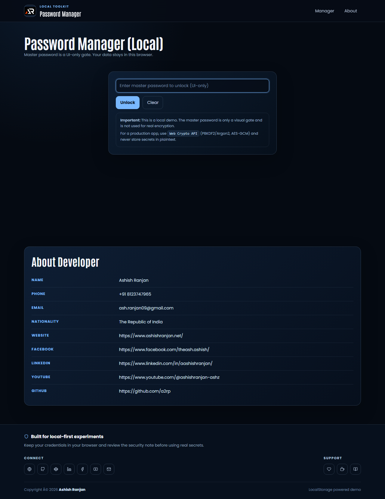

# Password Manager

A responsive local-first React password manager for practicing credential CRUD, password generation, searching, filtering, and sorting in the browser.



## Features

- UI-only session unlock screen with a clear security disclaimer
- Add, edit, duplicate, delete, reveal, and copy credentials
- Generate strong passwords with the browser crypto API
- Search by site, username, URL, or tag
- Filter by tag and sort by recent update, site, or username
- LocalStorage persistence with responsive dark UI
- Fixed navigation, icon-only social and support footer, and scroll-to-top control

## Tech stack

React, Vite, styled-components, react-icons, and LocalStorage.

## Run locally

```bash
npm install
npm run dev
```

Create a production build with `npm run build`. Deploy to GitHub Pages with `npm run deploy`.

Live URL: [a2rp.github.io/password-manager](https://a2rp.github.io/password-manager/)

This is a UI practice project. The unlock screen is not encryption, and credentials are stored as plain browser data. Do not use it for real secrets.

## Links

- Portfolio: [https://www.ashishranjan.net/](https://www.ashishranjan.net/)
- GitHub: [https://github.com/a2rp](https://github.com/a2rp)
- CodePen: [https://codepen.io/ash1198](https://codepen.io/ash1198)
- LinkedIn: [https://www.linkedin.com/in/aashishranjan](https://www.linkedin.com/in/aashishranjan)
- Facebook: [https://www.facebook.com/theash.ashish/](https://www.facebook.com/theash.ashish/)
- YouTube: [https://www.youtube.com/@ashishranjan-ashz?sub_confirmation=1](https://www.youtube.com/@ashishranjan-ashz?sub_confirmation=1)
- Email: [ash.ranjan09@gmail.com](mailto:ash.ranjan09@gmail.com)

## Support

- Support: [https://a2rp-donation-page.netlify.app/](https://a2rp-donation-page.netlify.app/)
- Buy Me a Coffee: [https://buymeacoffee.com/a2rp](https://buymeacoffee.com/a2rp)
- Patreon: [https://www.patreon.com/a2rp](https://www.patreon.com/a2rp)
